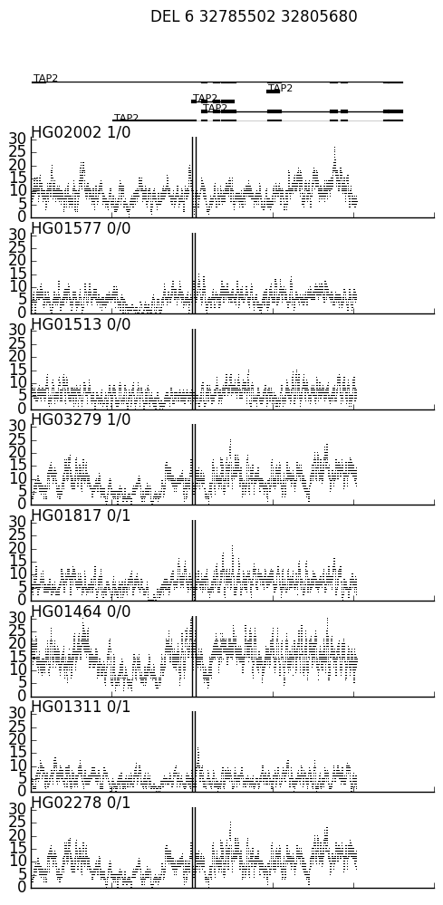
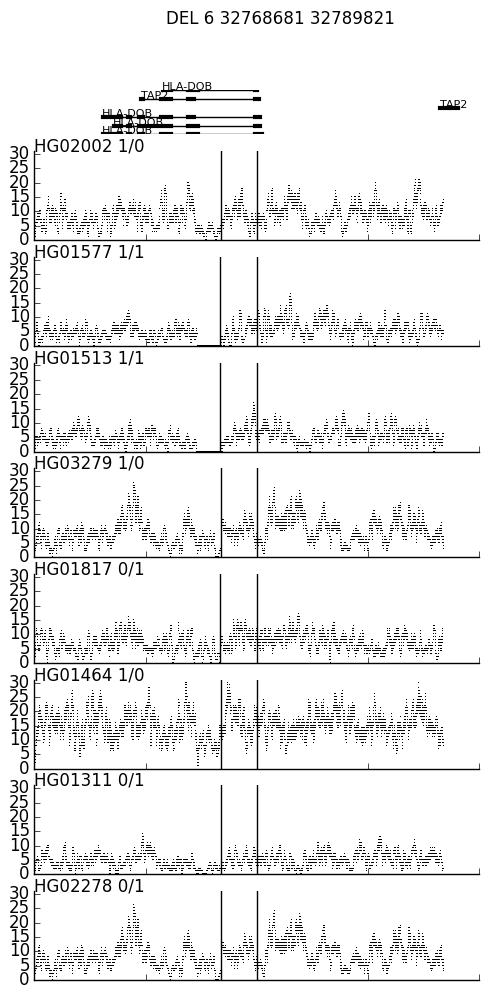

# SVView

A two-step process that can help visualize the coverage near a variant across multiple BAMs.

    $ bcftools view test/test.vcf.gz | ./sv_depth.py test/test.ped 1000
    
`sv_depth.py` creates a covrage file for each SV named "var_ID.txt".  In this case it creates `var_DEL_pindel_18715.txt` and `var_UW_VH_5456.txt`.  The parameter to `sv_depth.py` modulates the distance up and down stream of the the SV.

Visualize these coverages with `spark.py`, which takes an exome file, a map from transcrip to gene name, and an ouputfile.
  
    $ cat var_DEL_pindel_18715.txt \
        | ./spark.py \
            -e data/h37_ensemble_exons.bed.gz \
            -n data/h37_ensemble_exons.togenename.txt \
            -o var_DEL_pindel_18715.png

    $ cat var_UW_VH_5456.txt \
        | ./spark.py \
            -e data/h37_ensemble_exons.bed.gz \
            -n data/h37_ensemble_exons.togenename.txt \
            -o var_UW_VH_5456.png

